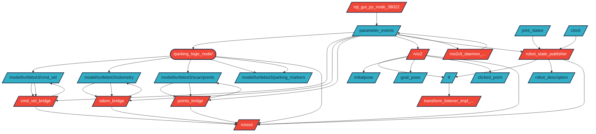
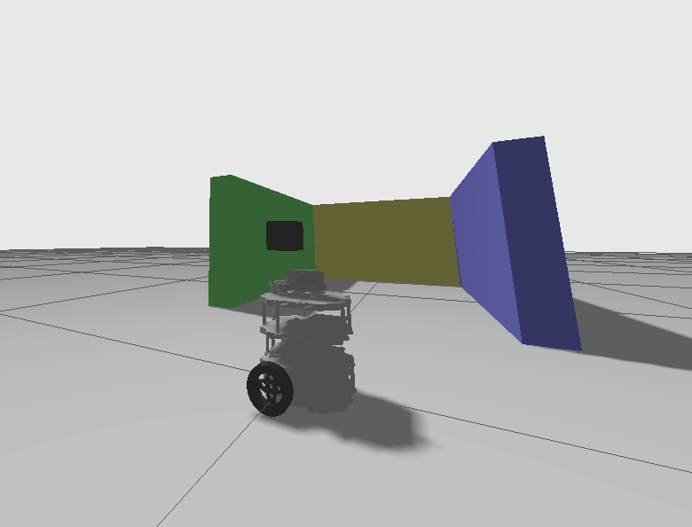
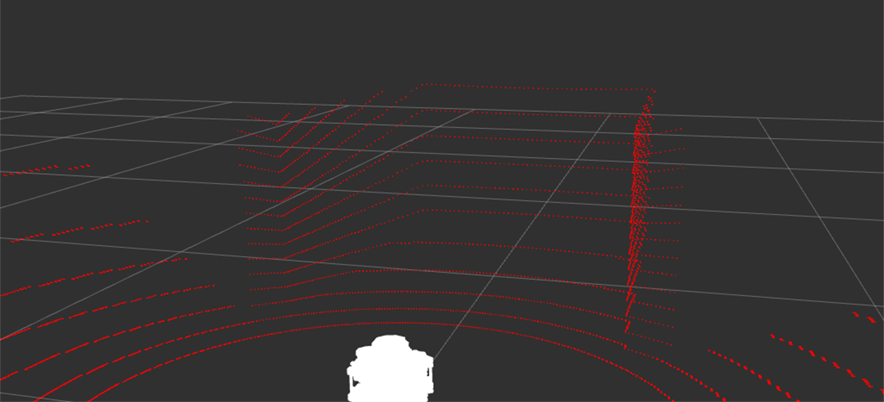
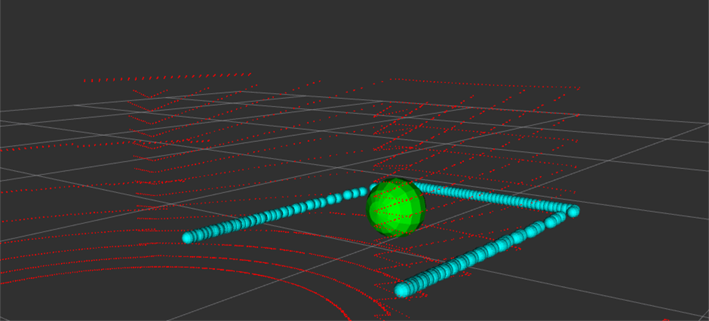

# var_n7k_parkbot

## English

**var_n7k_parkbot** is a ROS 2 (Humble) Python package for autonomous parking logic simulation with TurtleBot3 in Gazebo, including LIDAR-based parking spot detection and visualization in RViz.

### Quick Start

1. **Clone the package**
    ```bash
    cd ~/ros2_ws/src
    git clone https://github.com/samuvarga/var_n7k_parkbot
    ```

2. **Build the package**
    ```bash
    cd ~/ros2_ws
    colcon build --packages-select var_n7k_parkbot --symlink-install
    ```

3. **Source the workspace**
    ```bash
    source ~/ros2_ws/install/setup.bash
    ```

4. **Launch the simulation (Gazebo + RViz + bridges)**
    ```bash
    ros2 launch var_n7k_parkbot gazebo_with_robot.launch.py
    ```

5. **In a new terminal, source the workspace again and start the parking logic node:**
    ```bash
    cd ~/ros2_ws
    source install/setup.bash
    ros2 run var_n7k_parkbot parking_logic_node
    ```

- The launch file starts Gazebo with the parking world, bridges topics, and opens RViz with the correct config.
- The parking logic node must be started manually in a separate terminal.
- LIDAR point clouds and detected parking spots are visualized in RViz.

---

## Graph / Mermaid diagram



---

## Screenshots

Here you will find images of the running project, RViz, and the parking logic results.


*Simulation world*


*LIDAR data in RViz*


*Detected clusters*


---

## Magyar

A **var_n7k_parkbot** egy ROS 2 (Humble) Python csomag, amely TurtleBot3-hoz készült parkolási logikát, LIDAR-alapú parkolóhely-felismerést és RViz vizualizációt tartalmaz Gazebo szimulációban.

### Gyors indítás

1. **Csomag klónozása**
    ```bash
    cd ~/ros2_ws/src
    git clone https://github.com/samuvarga/var_n7k_parkbot
    ```

2. **Fordítás**
    ```bash
    cd ~/ros2_ws
    colcon build --packages-select var_n7k_parkbot --symlink-install
    ```

3. **Workspace forrásolása**
    ```bash
    source ~/ros2_ws/install/setup.bash
    ```

4. **Szimuláció indítása (Gazebo + RViz + bridge-ek)**
    ```bash
    ros2 launch var_n7k_parkbot gazebo_with_robot.launch.py
    ```

5. **Új terminálban workspace forrásolása és a parkolási logika node indítása:**
    ```bash
    cd ~/ros2_ws
    source install/setup.bash
    ros2 run var_n7k_parkbot parking_logic_node
    ```

- A launch file elindítja a Gazebo szimulációt a parkoló világgal, beállítja a bridge-eket, és megnyitja az RViz-t a megfelelő konfigurációval.
- A parkolási logika node-ot külön terminálban kell elindítani.
- Az RViz-ben látható a LIDAR pontfelhő és a detektált parkolóhelyek.

---

## Graph / Mermaid diagram


---

## Képek / Screenshots

Itt láthatók a projekt futásáról, az RViz-ről és a parkolási logika eredményeiről készült képek.


*Szimulációs világ*


*LIDAR adatok az RViz-ben*


*Detektált klaszterek*


---

**Fejlesztői információk, részletes leírás és konfigurációk a forráskódban találhatók.**